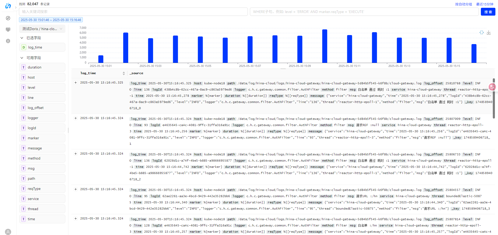
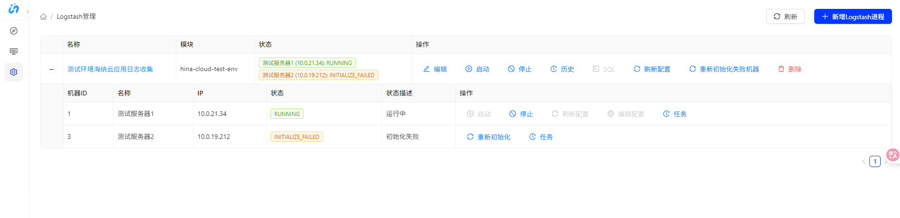
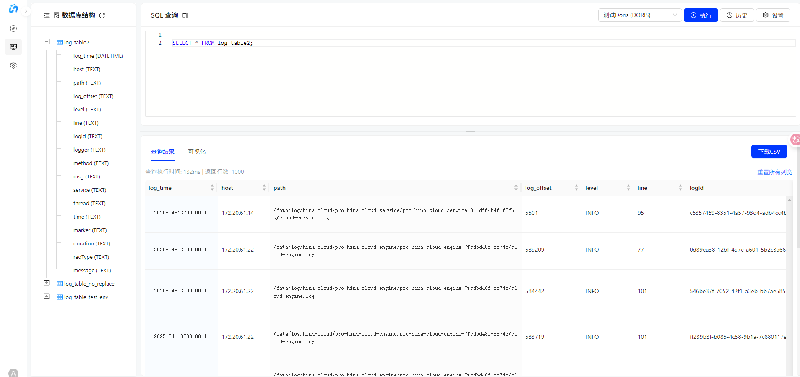

<div align="center">


# ⚡ 秒查 - 企业级日志管理平台

## 🚀 基于 Doris 的高性能日志系统，提供 10x 性能提升和秒级扩缩容能力

<p align="center">
  📚&nbsp <a href="#-快速开始" target="_blank"><b>快速开始</b></a>&nbsp&nbsp&nbsp
  🔥&nbsp <a href="#-logstash-扩容缩容功能" target="_blank"><b>🆕 扩容缩容功能</b></a>&nbsp&nbsp&nbsp
  📖&nbsp <a href="#api接口文档" target="_blank"><b>API 文档</b></a>&nbsp&nbsp&nbsp
  🏗️&nbsp <a href="#项目架构" target="_blank"><b>系统架构</b></a>&nbsp&nbsp&nbsp
</p>

[](https://github.com/your-org/miaocha-system/releases)
[](https://www.oracle.com/java/)
[](https://spring.io/projects/spring-boot)
[](https://opensource.org/licenses/Apache-2.0)
[](https://github.com/your-org/miaocha-system)
[](https://hub.docker.com/r/your-org/miaocha-system)
[](https://github.com/your-org/miaocha-system/pulls)

<a href="https://github.com/your-org/miaocha-system" target="_blank">

</a>

</div>

---

## 💡 项目概述

> **⚡ 秒查（MiaoQuery）**是一个基于 **Spring Boot** 的**企业级日志管理平台**。它提供了完整的日志采集、存储、查询、分析和 **Logstash 进程管理**功能，支持**分布式部署**和**扩缩容操作**，让您能够秒级查询海量日志数据。

### 👨‍💻 开发者

**🔥 主要开发者**: [**Miskai**](https://github.com/Misaki030112) - 秒查后端架构师 & 核心开发者

### ⭐ 为什么选择秒查？

- ⚡ **秒级查询**: 基于 Doris 的高性能日志检索引擎，毫秒级响应
- 💰 **成本优化**: 智能资源调度，降低 50%+ 运维成本
- 🚀 **秒级扩容**: Logstash 进程支持秒级水平扩缩容
- 🛡️ **高可靠**: 分布式架构，99.99% 服务可用性
- 🔧 **零运维**: 内置自动化运维和故障恢复
- 📊 **实时监控**: 完整的监控指标和告警机制

---

## 🎯 核心功能

<table>
<tr>
<td width="50%">

### 🔐 认证权限管理

- **JWT认证机制**: 安全的用户身份验证
- **细粒度权限**: 模块级别权限控制
- **多租户支持**: 企业级多租户隔离

### 📊 日志搜索分析

- **高性能检索**: 支持复杂查询条件
- **实时统计**: 时间分布和字段分析
- **可视化图表**: 直观的数据展示

### 🔄 Logstash 管理

- **生命周期管理**: 部署、配置、监控
- **🆕 智能扩缩容**: 秒级水平扩展能力
- **状态机驱动**: 可靠的状态管理

</td>
<td width="50%">

### 💾 数据源管理

- **多数据源**: 统一管理多种数据源
- **连接池**: 高效的连接管理
- **配置热更新**: 动态配置更新

### 🖥️ SQL编辑器

- **查询执行**: SQL查询和结果导出
- **性能优化**: 查询结果缓存
- **语法验证**: 智能SQL解析

### 🖧 任务调度

- **异步处理**: 高性能任务执行
- **状态监控**: 实时任务状态跟踪
- **故障恢复**: 自动重试机制

</td>
</tr>
</table>

---

## 📸 系统界面展示

<div align="center">

### 🔍 日志查询分析界面



**🔥 核心后端功能支持**：
- 🚀 高性能日志搜索 API
- 📈 时间分布统计算法  
- 🔄 字段分布分析引擎
- ⚡ 查询结果缓存和优化

---

### ⚙️ Logstash 管理界面



**🎛️ 后端管理能力**：
- 🔄 状态机驱动的进程管理
- 🌐 分布式部署协调
- 📊 实时状态监控
- 🆕 **智能扩容缩容算法**

---

### 💻 SQL 编辑器界面



**🔍 后端查询引擎**：
- ✅ SQL 解析和验证
- ⚡ 查询性能优化
- 📄 结果集分页处理
- 🔗 多数据源连接池管理

</div>

---

## 🆕 Logstash 扩容缩容功能

> 🌟 **新特性亮点**: 支持对已创建的 Logstash 进程进行**动态扩容和缩容**操作

<div align="center">
<table>
<tr>
<td width="50%" align="center">

### 📈 扩容功能

🔹 **动态添加机器**: 向现有进程添加服务器节点  
🔹 **自动环境初始化**: 自动部署配置 Logstash 环境  
🔹 **模板复用**: 利用原有配置信息进行扩容  
🔹 **自定义部署路径**: 支持特定部署路径配置  
🔹 **连接性验证**: 扩容前自动验证机器状态

</td>
<td width="50%" align="center">

### 📉 缩容功能

🔸 **安全缩容**: 智能移除指定服务器节点  
🔸 **防御性检查**: 确保至少保留一台机器  
🔸 **状态感知**: 根据运行状态智能处理  
🔸 **强制缩容**: 支持强制停止运行中机器  
🔸 **资源清理**: 自动清理部署文件和任务

</td>
</tr>
</table>
</div>

### 🎯 使用场景

|     场景      |       描述        |      效果       |
|-------------|-----------------|---------------|
| 🚀 **业务扩展** | 日志处理量增加时动态添加节点  | 📊 线性性能提升     |
| 💰 **成本优化** | 业务低峰期减少资源消耗     | 💵 降低 50%+ 成本 |
| 🔧 **故障恢复** | 快速替换故障机器或添加备用节点 | ⚡ 秒级故障恢复      |
| 🔄 **环境迁移** | 渐进式迁移服务到新服务器    | 🛡️ 零停机迁移     |

### 🔌 API 接口

```http
POST /api/logstash/processes/{id}/scale
```

---

## 🛠️ 技术栈

<div align="center">
<table>
<tr>
<td width="50%" align="center">

### 🔧 后端技术栈

[](https://openjdk.org/)
[](https://spring.io/)
[](https://spring.io/projects/spring-security)
[](https://mybatis.org/)
[](https://www.mysql.com/)
[](https://www.docker.com/)

</td>
<td width="50%" align="center">

### 🎨 前端技术栈

[](https://reactjs.org/)
[](https://ant.design/)
[](https://www.typescriptlang.org/)
[](https://vitejs.dev/)
[](https://axios-http.com/)

</td>
</tr>
</table>
</div>

---

## 🔍 日志搜索与分析功能

<div align="center">

### 🎯 核心能力一览

|      功能模块      |            描述             |  技术特点   |
|----------------|---------------------------|---------|
| 🔍 **日志明细查询**  | 多条件组合查询，支持时间范围、关键词等       | ⚡ 毫秒级响应 |
| 📊 **时间分布分析**  | 生成时间柱状图，支持多粒度聚合           | 📈 实时统计 |
| 🏷️ **字段分布统计** | TOP N值分布分析，利用Doris TOPN函数 | 🚀 高效计算 |
| 📋 **表结构查询**   | 动态获取字段信息，支持类型描述           | 🔄 动态构建 |

</div>

### 🔌 API接口列表

```bash
🔍 /api/logs/search/details          # 日志明细查询
📊 /api/logs/search/histogram        # 时间分布统计  
🏷️ /api/logs/search/field-distributions  # 字段分布分析
📋 /api/logs/columns                 # 表结构信息
```

---

## ⚙️ Logstash进程管理

> 🔥 **Logstash进程管理模块**提供了对Logstash实例的**完整生命周期管理**，包括部署、配置、启动、监控、停止、扩容和缩容。

<div align="center">

### 🔄 状态机驱动架构

|            状态            |  描述   |     操作     |
|--------------------------|-------|------------|
| 🔄 **INITIALIZING**      | 初始化中  | 创建过程中的初始状态 |
| ⏸️ **NOT_STARTED**       | 未启动   | 初始化完成但未启动  |
| 🚀 **STARTING**          | 正在启动  | 启动进程中      |
| ✅ **RUNNING**            | 运行中   | 进程正常运行     |
| ⏹️ **STOPPING**          | 正在停止  | 停止进程中      |
| ❌ **START_FAILED**       | 启动失败  | 启动过程中遇到错误  |
| ⚠️ **STOP_FAILED**       | 停止失败  | 停止过程中遇到错误  |
| 🔧 **INITIALIZE_FAILED** | 初始化失败 | 可以重新初始化    |

</div>

### 🎛️ 核心功能模块

<table>
<tr>
<td width="50%">

#### 🏗️ 环境部署与初始化

- 🚀 **远程部署**: Logstash软件包自动部署
- ⚙️ **环境初始化**: 配置环境自动初始化
- 📁 **配置管理**: 上传和管理配置文件
- 🔧 **故障恢复**: 支持重新初始化失败的实例

#### 🔄 进程控制

- ▶️ **启动进程**: 智能启动Logstash进程
- ⏹️ **停止进程**: 优雅停止Logstash进程
- 📊 **状态监控**: 实时监控进程状态
- 🔁 **自动恢复**: 自动恢复失败进程

</td>
<td width="50%">

#### ⚙️ 配置管理

- 📝 **主配置文件**: 支持管理主配置文件
- ☕ **JVM选项**: 支持自定义JVM选项
- 🔧 **logstash.yml**: 支持修改配置
- 🔄 **版本控制**: 配置同步和版本控制

#### 🌐 多机器部署

- 🖥️ **多机部署**: 支持多台机器部署同一进程
- 🔀 **独立管理**: 独立管理每台机器进程状态
- 📦 **批量操作**: 批量操作多台机器

</td>
</tr>
</table>

### 🔧 重新初始化功能

当Logstash机器实例初始化失败时，系统提供了**重新初始化功能**：

**🎯 功能特性**
- 🔍 **状态检查**: 严格限制只有 `INITIALIZE_FAILED` 状态的机器才能重新初始化
- 🎛️ **双模式操作**: 支持单机器和批量重新初始化两种模式
- 🔄 **完整流程**: 删除原有目录、重新创建环境、上传配置等
- 🛡️ **事务保证**: 确保操作的原子性和数据一致性

**🔌 API接口**

```http
POST /api/logstash/processes/{id}/reinitialize
POST /api/logstash/processes/{id}/machineInfos/{machineId}/reinitialize
```

---

## 🔌 API接口大全

<div align="center">

### 📋 完整接口列表

|      分类       |                                  接口                                  |      描述      |          方法           |
|---------------|----------------------------------------------------------------------|--------------|-----------------------|
| 🔄 **进程管理**   | `/api/logstash/processes`                                            | 管理Logstash进程 | `GET/POST/PUT/DELETE` |
| ⚙️ **配置管理**   | `/api/logstash/processes/{id}/config`                                | 管理进程配置       | `GET/PUT`             |
| ▶️ **启动控制**   | `/api/logstash/processes/{id}/start`                                 | 全局启动进程       | `POST`                |
| ⏹️ **停止控制**   | `/api/logstash/processes/{id}/stop`                                  | 全局停止进程       | `POST`                |
| 🖥️ **单机启动**  | `/api/logstash/processes/{id}/machineInfos/{machineId}/start`        | 启动特定机器进程     | `POST`                |
| 🖥️ **单机停止**  | `/api/logstash/processes/{id}/machineInfos/{machineId}/stop`         | 停止特定机器进程     | `POST`                |
| 🆕 **扩容缩容**   | `/api/logstash/processes/{id}/scale`                                 | **扩容或缩容进程**  | `POST`                |
| 🔧 **批量重初始化** | `/api/logstash/processes/{id}/reinitialize`                          | 重新初始化所有失败的机器 | `POST`                |
| 🔧 **单机重初始化** | `/api/logstash/processes/{id}/machineInfos/{machineId}/reinitialize` | 重新初始化指定机器    | `POST`                |

</div>

### 📚 API接口文档

🔗 **Swagger UI文档**: `http://<serverIp>:<port>/swagger-ui/index.html#/`

---

## 🚀 快速开始

<div align="center">

### 🏃‍♂️ 一键启动

</div>

```bash
# 📥 1. 克隆项目
git clone <repository-url>
cd log-manage-system

# 🔧 2. 配置数据库连接  
# 编辑 log-manage-server/src/main/resources/application-dev.yml

# 🏗️ 3. 构建项目
mvn clean package

# 🚀 4. 启动应用
cd log-manage-server
mvn spring-boot:run -Dspring-boot.run.profiles=dev
```

### 🐳 Docker 部署

```bash
# 🏗️ 构建并启动
./build-start-docker.sh

# 🧹 清理镜像
./clean-docker-images.sh
```

### 🌍 环境信息

|     环境      |               地址               |   描述    |
|-------------|--------------------------------|---------|
| 🧪 **测试环境** | `http://10.254.133.210:32088/` | 后端API地址 |

---

## 🏗️ 项目架构

> **🎯 分层架构设计**: 采用**领域驱动设计(DDD)**原则，确保代码的**高内聚、低耦合**

<div align="center">

### 📁 目录结构

```
🏗️ log-manage-server/src/main/java/com/hina/log/
├── 🚀 LogManageSystemApplication.java     # Spring Boot 启动类
├── 🌐 endpoint/                          # API接口层 (Interface Layer)
├── 💼 application/                       # 应用服务层 (Application Layer)
│   ├── 🔧 service/                      # 应用服务
│   ├── ⚙️ logstash/                     # Logstash相关应用服务
│   ├── 🔐 security/                     # 安全相关配置
│   └── 🔍 filter/                       # 过滤器
├── 🏛️ domain/                           # 领域层 (Domain Layer)
│   ├── 📊 entity/                       # 领域实体
│   ├── 📦 dto/                          # 数据传输对象
│   ├── 🗄️ mapper/                       # 数据访问接口
│   └── 🔄 converter/                    # 对象转换器
├── 🛠️ common/                           # 通用模块 (Infrastructure Layer)
│   ├── 🔧 util/                         # 工具类
│   ├── ⚠️ exception/                    # 异常处理
│   ├── 🔗 ssh/                          # SSH工具
│   └── 📝 annotation/                   # 自定义注解
└── ⚙️ config/                           # 配置模块
```

</div>

### 🎯 分层架构详解

<table>
<tr>
<td width="50%">

#### 🌐 Endpoint层 (Interface Layer)

**📝 职责**: 接收HTTP请求，参数校验和格式转换

**🔧 主要组件**:
- 🔐 `AuthEndpoint`: 用户认证接口
- 🗄️ `DatasourceEndpoint`: 数据源管理接口  
- 🔍 `LogSearchEndpoint`: 日志搜索接口
- ⚙️ `LogstashProcessEndpoint`: **Logstash管理接口**
- 🖥️ `MachineEndpoint`: 机器管理接口
- 🔒 `ModulePermissionEndpoint`: 权限管理接口
- 💻 `SqlEditorQueryEndpoint`: SQL编辑器接口
- 👤 `UserEndpoint`: 用户管理接口

#### 🏛️ Domain层 (Domain Layer)

**📝 职责**: 核心业务实体和业务逻辑

**🔧 主要组件**:
- 📊 **实体类**: `LogstashProcess`, `MachineInfo` 等
- 📦 **DTO类**: 包含 🆕 `LogstashProcessScaleRequestDTO`
- 🗄️ **Mapper**: MyBatis数据访问接口
- 🔄 **Converter**: 对象转换器

</td>
<td width="50%">

#### 💼 Application层 (Application Layer)

**📝 职责**: 应用服务和业务流程编排

**🔧 主要组件**:
- 🔧 **核心服务**: 包含 `LogstashProcessService` (含扩容缩容逻辑)
- ⚙️ **Logstash服务**:
- `LogstashProcessDeployService`: 部署服务
- `LogstashConfigSyncService`: 配置同步
- `state/`: 状态管理相关类
- `command/`: 命令模式实现
- `task/`: 任务管理

#### 🛠️ Common层 (Infrastructure Layer)

**📝 职责**: 基础设施和通用功能支持

**🔧 主要组件**:
- 🔧 **工具类**: 通用辅助方法
- ⚠️ **异常处理**: 自定义异常和全局处理器
- 🔗 **SSH工具**: 远程连接和文件操作
- 📝 **注解**: AOP和权限控制注解

</td>
</tr>
</table>

### 🎨 核心设计模式

<div align="center">

|     设计模式      |      应用场景      |     效果      |
|---------------|----------------|-------------|
| 🔄 **状态模式**   | Logstash机器状态管理 | 🎯 清晰的状态转换  |
| 📤 **命令模式**   | SSH命令执行        | 🔧 灵活的命令处理  |
| 🎯 **策略模式**   | 不同类型数据源处理      | 🔀 可扩展的策略选择 |
| 👁️ **观察者模式** | 任务状态监控         | 📊 实时状态通知   |
| 🏭 **工厂模式**   | 对象创建           | 🎪 统一的对象创建  |

</div>

### ⭐ 技术特性

- 🏗️ **分层架构**: 清晰的职责分离
- 🎯 **领域驱动**: 以业务为核心的设计
- 🔄 **状态管理**: 完善的状态机实现
- ⚡ **异步处理**: 支持异步任务执行
- 🔒 **事务管理**: 确保数据一致性
- 🛡️ **安全控制**: 完善的认证授权机制

---

## 📊 配置管理

<div align="center">

### 🎛️ 多环境配置

|           配置文件            |     环境     |   用途   |
|---------------------------|------------|--------|
| 📄 `application.yml`      | 🔧 基础配置    | 通用配置项  |
| 🧪 `application-dev.yml`  | 👨‍💻 开发环境 | 开发调试配置 |
| 🧪 `application-test.yml` | 🧪 测试环境    | 测试环境配置 |
| 🏭 `application-prod.yml` | 🏭 生产环境    | 生产环境配置 |

</div>

**🔧 主要配置项**:
- 🗄️ 数据库连接信息
- 🔐 JWT认证配置  
- ⚙️ Logstash配置
- 📊 SQL查询导出配置

### 📝 日志配置策略

<table>
<tr>
<td width="33%" align="center">

#### 👨‍💻 开发环境 (dev)

- 🌈 控制台彩色输出
- 📄 普通格式文件
- 📋 JSON格式文件

</td>
<td width="33%" align="center">

#### 🧪 测试环境 (test)

- 📺 控制台输出
- 📄 普通格式文件
- 📋 JSON格式文件

</td>
<td width="33%" align="center">

#### 🏭 生产环境 (prod)

- 📋 仅JSON格式文件输出
- ⚡ 异步高性能输出
- 📊 监控系统集成

</td>
</tr>
</table>

**📊 日志文件类型**:
- 📄 `log-manage-system.log`: 普通格式日志（开发调试）
- 📋 `log-manage-system-json.log`: JSON格式日志（INFO及以下）
- ❌ `log-manage-system-json-error.log`: JSON格式错误日志（ERROR级别）

**🔄 日志轮转策略**:
- 📅 按日期和大小轮转 (单文件最大100MB)
- 📚 默认保留30天历史日志
- 💾 总大小限制1GB
- ⚡ 异步输出提高性能

---

## 🗄️ 数据库结构

> 🔄 **Flyway版本控制**: 使用Flyway进行数据库版本控制和迁移管理，脚本位于 `src/main/resources/db/migration` 目录

---

## 👨‍💻 开发环境搭建

### 🛠️ 环境准备

|      组件       |     版本要求      |   描述   |
|---------------|---------------|--------|
| ☕ **Java**    | JDK 17+       | 核心运行环境 |
| 🗄️ **MySQL** | 8.0+          | 数据库服务  |
| 📦 **Maven**  | 3.6+          | 构建工具   |
| 💻 **IDE**    | IntelliJ IDEA | 推荐开发工具 |

### 🎨 代码格式化与质量控制

**🚀 快速开始**:

```bash
# 🔧 安装Git pre-commit hooks（推荐）
./scripts/install-git-hooks.sh

# ✨ 手动格式化代码
./scripts/format-code.sh

# ⚡ 快速构建（跳过代码质量检查）
mvn clean install -Pquick
```

**🛠️ 工具栈**:
- ✨ **Spotless Maven Plugin**: Google Java Format标准格式化
- 🔍 **Checkstyle**: 静态代码分析
- 📝 **EditorConfig**: IDE编码风格一致性

📚 **详细说明**: [代码格式化指南](docs/CODE_STYLE.md)

---

## 🤝 如何贡献

<div align="center">

### 📋 贡献流程


</div>

1. 🍴 **Fork项目**
2. 🌿 **创建功能分支** (`git checkout -b feature/amazing-feature`)
3. 📝 **提交更改** (`git commit -m 'Add some amazing feature'`)
4. 📤 **推送分支** (`git push origin feature/amazing-feature`)
5. 📬 **打开Pull Request**

---

## 📞 技术支持

<div align="center">

### 📚 文档资源

|       资源        |    描述    |                                 链接                                 |
|-----------------|----------|--------------------------------------------------------------------|
| 📖 **项目README** | 主要文档     | [README.md](README.md)                                             |
| 📝 **日志配置**     | 日志系统配置说明 | [日志配置文档](docs/LOGGING_CONFIGURATION.md)                            |
| 🎉 **发布说明**     | 版本更新内容   | [1.0.0版本发布说明](docs/RELEASE_NOTES_v1.0.0.md)                        |
| 🚀 **部署指南**     | 生产环境部署   | [部署检查清单](docs/DEPLOYMENT_CHECKLIST_v1.0.0.md)                      |
| 🐛 **问题反馈**     | Bug报告和建议 | [GitHub Issues](https://github.com/your-org/miaocha-system/issues) |

</div>

---

<div align="center">

### 🌟 如果这个项目对您有帮助，请给我们一个 Star ⭐

[](https://github.com/your-org/miaocha-system)

**📧 联系我们**: [your-email@company.com](mailto:your-email@company.com)

</div>

---

<div align="center">

### 👨‍💻 关于开发者

**⚡ 秒查**由 **[Miskai](https://github.com/Misaki030112)** 精心设计和开发  
专注于高性能日志管理系统的架构设计与实现

<sub>🎨 Built with ❤️ by Miskai & 秒查团队 | 📜 Licensed under Apache 2.0</sub>

</div>

