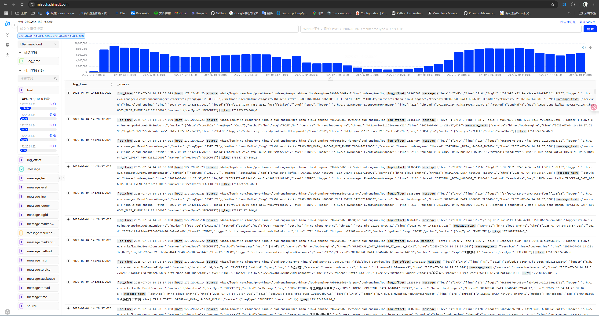
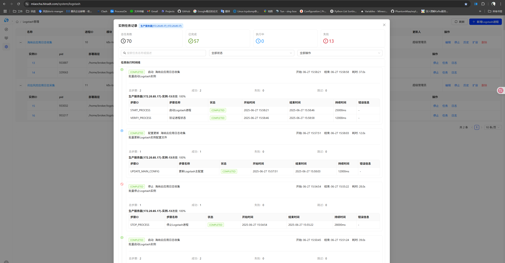
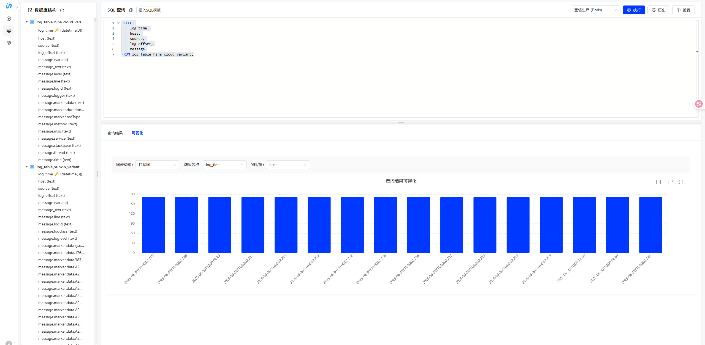

<div align="center">


# 🔍 秒查 - 企业级日志管理平台
  
## 🚀 基于 Apache Doris 的高性能日志检索系统

[](https://github.com/Hinadt-Inc/miaocha)
[](https://www.oracle.com/java/)
[](https://spring.io/projects/spring-boot)
[](https://react.dev/)
[](https://opensource.org/licenses/Apache-2.0)

</div>

---

## 📖 关于秒查

**秒查（Miaocha）** 是一款专为企业设计的开源日志分析平台。基于 **Spring Boot 3.x** 和 **React 19** 构建，并以 **Apache Doris** 作为核心存储引擎，我们致力于提供闪电般的毫秒级日志查询、深度智能分析以及一站式的自动化日志采集方案。通过其强大的分布式部署能力和界面化的 Logstash 进程管理，秒查能够轻松应对海量日志挑战，助力企业提升运维效率和洞察力。

### ⭐ 核心功能

- ⚡ **闪电查询**：基于 Apache Doris 的高性能检索引擎，实现海量日志数据的毫秒级响应。
- 🎯 **智能分析**：支持多维度、自定义的复杂查询逻辑。能够轻松接管并隔离不同业务线的日志模块，实现精细化的权限与查询配置。
- 🚀 **一站式采集**：内置强大的 Logstash 管理功能。通过简洁的界面，实现 Logstash 的远程部署、一键启停、配置热更新及弹性扩缩容，大幅简化日志采集运维。
- ✍️ **专业 SQL 编辑器**：为熟悉 SQL 的高级用户内置了功能完善的编辑器，支持智能提示、语法高亮、历史查询及结果导出，提供极致的查询体验。

---

## 📸 界面展示

### 日志主界面搜索


### Logstash 进程管理



### SQL 编辑器查询



---

## 🚀 快速开始


### 本地运行
```bash
# 1. 克隆项目
git clone https://github.com/Hinadt-Inc/miaocha
cd miaocha

# 2. 配置数据库
# 编辑 miaocha-server/src/main/resources/application-dev.yml

# 3. 构建项目
mvn clean package

# 4. 启动后端
cd miaocha-server
mvn spring-boot:run -Dspring-boot.run.profiles=dev

# 5. 启动前端
cd miaocha-ui/frontend
npm install
npm run dev
```

### Docker 部署

```bash
# 构建并启动
./scripts/build-start-docker.sh

# 清理镜像
./scripts/clean-docker-images.sh
```

---

## 📝 文档资源

**`开发相关手册`**

*   [架构设计文档](docs/dev_guide/架构设计.md)
*   [本地开发指南](docs/dev_guide/本地开发指南.md)
*   [代码贡献规范](docs/dev_guide/代码贡献规范.md)
*   [API 接口文档](docs/dev_guide/API接口文档.md)

**`产品使用手册`**

*   [产品快速入门](docs/user_guide/产品快速入门.md)
*   [日志接入指南](docs/user_guide/日志接入指南.md)
*   [查询分析手册](docs/user_guide/查询分析手册.md)
*   [FAQ 常见问题](docs/user_guide/FAQ.md)

**我们正在努力完善文档，欢迎您通过 [Issue](https://github.com/Hinadt-Inc/miaocha/issues) 或 [Pull Request](https://github.com/Hinadt-Inc/miaocha/pulls) 帮助我们改进！**

---

## 🌟 社区与贡献

我们是一个开放和友好的社区，欢迎任何形式的贡献！

*   **提 Issue**：[报告 Bug 或提出功能建议](https://github.com/Hinadt-Inc/miaocha/issues/new/choose)。
*   **贡献代码**：请先阅读我们的 [代码贡献规范](docs/dev_guide/代码贡献规范.md)。
*   **完善文档**：帮助我们改进不清晰或有遗漏的文档。

欢迎访问我们的 [GitHub 仓库](https://github.com/Hinadt-Inc/miaocha) 并给项目一个 Star ⭐ 支持！

---

<sub>🎨 Built with ❤️ | 📜 Licensed under Apache 2.0</sub>
