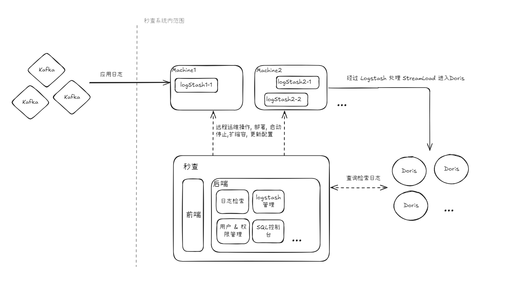

## 1. 架构设计哲学

秒查系统的架构设计遵循**高内聚、低耦合**的核心原则，旨在构建一个**高性能、可扩展、易于维护**的企业级日志平台。我们采用前后端分离的现代化开发模式，并通过标准化的接口进行通信，确保了技术栈的灵活性和团队的并行开发效率。

后端服务 `miaocha-server` 在设计上借鉴了**领域驱动设计（DDD）** 的思想，通过分层架构将复杂的业务逻辑清晰地隔离，使得系统核心功能更加健壮和专注。

## 2. 系统总体架构

秒查的整体架构由三大核心部分组成：**前端应用 (UI Layer)**、**后端服务 (Service Layer)** 和 **数据基础设施 (Data Plane)**。

*   **前端应用 (UI Layer)**
    *   **技术栈**: 基于 **React 19** 构建的现代化单页应用（SPA）。
    *   **职责**: 提供丰富的用户交互界面，包括日志检索、仪表盘、Logstash 实例管理、SQL 编辑器等。它是用户与秒查系统交互的唯一入口。

*   **后端服务 (Service Layer)**
    *   **技术栈**: 以 **Spring Boot 3** 为核心的模块化单体应用。
    *   **职责**: 作为系统的“大脑”，负责处理所有业务逻辑，包括用户认证、权限管理、日志查询解析、数据源管理以及对 Logstash 集群的生命周期管理。

*   **数据基础设施 (Data Plane)**
    *   **元数据库**: 采用 **MySQL**，存储用户信息、仪表盘配置、数据源信息等关键元数据。
    *   **日志存储**: 核心日志数据存储于 **Apache Doris**，利用其卓越的 OLAP 能力实现海量日志的毫秒级查询。
    *   **数据管道**: 通过 **Logstash** 实例进行日志的采集、过滤和转换，并利用 **Kafka** 作为数据缓冲，确保数据流的稳定与可靠。

## 3. 后端架构 (`miaocha-server`)

`miaocha-server` 采用了清晰的四层分层架构，确保了代码的隔离性与可测试性。

*   **端点层 (Endpoint Layer)**
    *   **实现**: 基于 Spring MVC 的 `RestController`。
    *   **职责**: 作为 API 网关，负责处理外部的 HTTP 请求，进行参数校验和基本的安全验证，并将请求委托给应用层。

*   **应用层 (Application Layer)**
    *   **职责**: 负责编排和协调领域服务，处理跨领域的业务流程。它不包含具体的业务规则，而是作为业务用例的直接体现，是连接端点层和领域层的桥梁。

*   **领域层 (Domain Layer)**
    *   **职责**: 系统业务逻辑的核心，包含了所有的领域模型、领域服务和业务规则。例如，Logstash 实例管理”的完整生命周期操作（创建、部署、启停、监控）都在此层实现。

*   **基础设施层 (Infrastructure Layer)**
    *   **职责**: 为其他层提供通用的技术支持。这包括与数据库（MySQL, Doris）的交互、通过 SSH 与远程服务器通信、操作缓存、发送消息等。它使得上层业务逻辑与具体的技术实现解耦。

## 4. 核心数据流

日志数据的采集和入库是秒查平台的核心链路，其流程如下：

1.  **日志源**: 用户的应用程序产生业务日志。
2.  **采集端**: 部署在应用服务器上的日志采集客户端（如 Filebeat, Fluentd）将日志统一发送至 **Kafka** 集群，形成中心化的数据总线。
3.  **处理与转发**: 由秒查平台部署和管理的 **Logstash** 实例消费 Kafka 中的日志数据，根据预设规则进行解析、清洗和格式化。
4.  **数据入库**: Logstash 通过 Doris 的 **Stream Load** 接口，高效地将处理后的日志数据批量写入 **Apache Doris** 集群，最终可供用户查询和分析。

