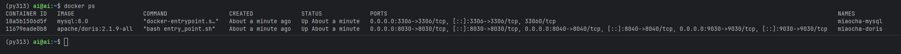
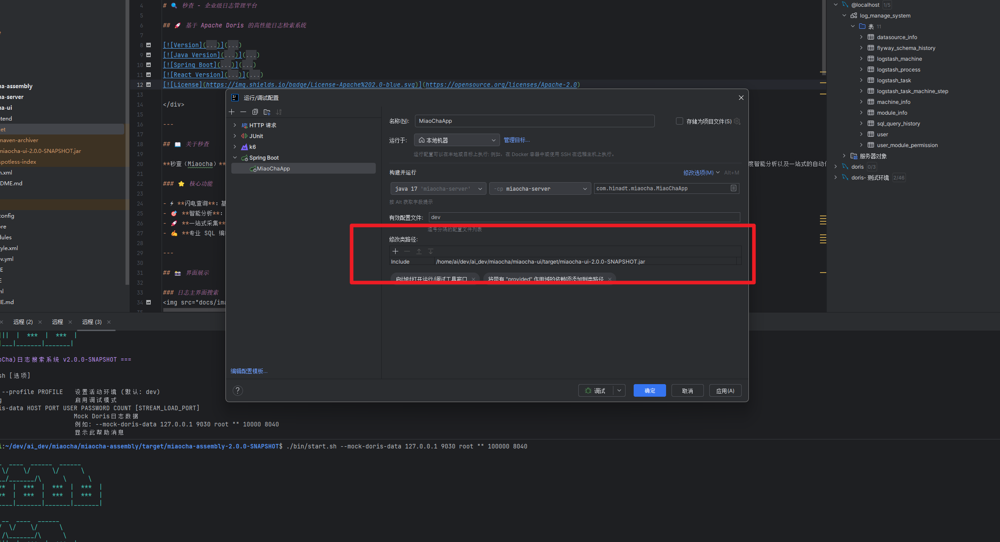
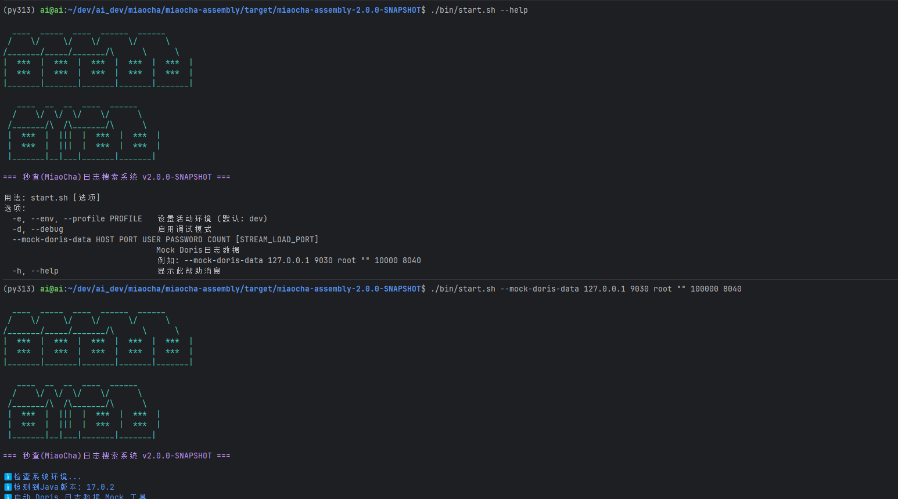

## 本地开发指南

本指南将引导您完成“秒查”项目在本地开发环境的完整搭建流程。与常规前后端分离开发模式不同，本项目的**前端应用是作为静态资源，被集成到后端服务中统一打包和提供服务的**。

### 1. 环境准备 (Prerequisites)

在开始之前，请确保您的开发环境中已安装以下软件，并满足版本要求：

*   **Java**: `17` 或更高版本
*   **Maven**: `3.8` 或更高版本
*   **Node.js**: `22` 或更高版本
*   **Docker** 和 **Docker Compose**: 用于运行项目依赖的基础设施

### 2. 获取源码 (Get the Source Code)

本项目的前端部分 (`miaocha-ui`) 是通过 Git Submodule 的方式进行管理的。因此，在克隆项目时，需要使用特定命令来确保前后端代码被完整拉取。

```bash
# 使用 --recurse-submodules 参数克隆主仓库及其所有子模块
git clone --recurse-submodules https://github.com/Hinadt-Inc/miaocha.git
cd miaocha
```

如果您已经克隆了仓库但忘记了 `--recurse-submodules` 参数，可以执行以下命令来补救：

```bash
git submodule update --init --recursive
```

### 3. 启动基础设施 (Start Infrastructure)

项目依赖 MySQL 和 Apache Doris 作为核心数据存储。我们提供了一个 Docker Compose 配置文件，可以一键启动所有必需的基础设施服务。

```bash
# 进入项目根目录，执行以下命令
docker-compose -f docker/compose/Infrastructure.yml up -d
```

启动成功后，您可以通过 `docker ps` 命令检查容器是否成功运行，如下图所示：


### 4. 本地集成开发 (Backend & Frontend Integrated)

在本地开发环境中，为了能通过后端服务直接访问前端页面，您需要先通过 Maven 构建 `miaocha-ui` 模块。该模块的 Maven 构建流程已**完全集成了前端编译**，会自动将生成的静态资源打包成一个 JAR 文件。**您无需手动执行任何 `npm` 命令**。

1.  **构建 UI 模块 (关键步骤)**:
    这是在 IDE 中启动 `miaocha-server` 之前必须完成的准备工作。
    ```bash
    # 在项目根目录执行
    # 此命令会构建 ui 模块，并将其产物（一个包含静态资源的 JAR）安装到本地 Maven 仓库
    mvn clean install -pl miaocha-ui
    ```

2.  **启动后端服务 (IntelliJ IDEA 为例)**:
    *   当 `miaocha-ui` 模块成功构建后，`miaocha-server` 就可以通过其在 `pom.xml` 中声明的依赖来引用前端资源。
    *   **关键配置**: 在 IDE 中，为了确保启动时能加载到最新的前端代码，您需要编辑 `MiaoChaApp` 的 **运行/调试配置 (Run/Debug Configuration)**。
    *   如下图所示，请在 `miaocha-server` 的启动配置中，手动添加 `miaocha-ui` 模块的编译产物 (JAR 包) 作为类路径依赖。

        

    *   配置完成后，直接运行 `MiaoChaApp` 启动类。项目启动成功后，在浏览器中访问后端的地址 (如 `http://localhost:8080`)，即可看到由后端服务提供的完整前端界面。

### 5. 生产打包 (Production Build)

当您需要将项目打包成可执行的 JAR 文件时：

*   **标准打包 (包含前端)**:
    ```bash
    # 在项目根目录执行
    mvn clean package
    ```
    这将执行完整的构建流程，包括前端编译，并生成一个包含所有静态资源的“胖”JAR。

*   **跳过前端打包 (纯后端)**:
    如果您只需要一个纯后端的服务包，可以使用 `-Pskip-ui` Profile。
    ```bash
    mvn clean package -Pskip-ui
    ```

### 6. (可选) 模拟日志数据 (Mock Log Data)

为了在开发阶段有充足的测试数据，我们提供了一个数据模拟工具。在执行完 `mvn clean package` 后，`miaocha-assembly` 模块会生成最终的部署包。

解压 `miaocha-assembly/target/miaocha-XXXXXXX-bin.tar.gz` 文件，您会看到如下结构：


请参照其 `bin/start.sh` 脚本中的说明来生成模拟的 Doris 日志数据。
